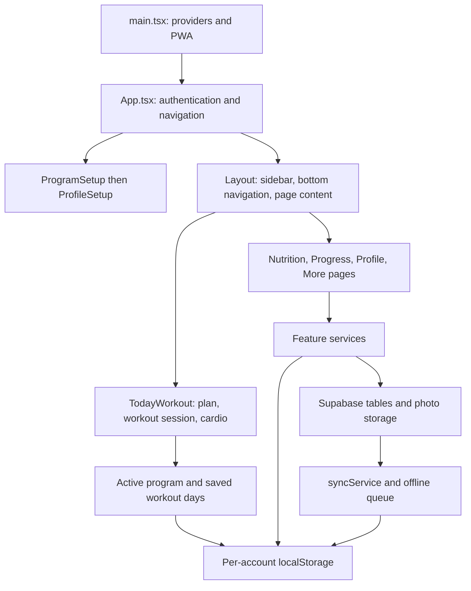

# Workout OS project map

Last updated: 2026-09-23. Read this before changing the app; update it in the same change whenever a page, feature, data flow, persistence format, or verification command changes.

## Application overview

Workout OS is a React 19 + TypeScript/JavaScript single-page app built with Vite. It supports local use and signed-in Supabase accounts, English/Vietnamese, offline persistence, and PWA installation. Navigation is React state, not URL routes.

## Where to find things

| Area | Main files | Responsibility |
| --- | --- | --- |
| Entry and app shell | `src/main.tsx`, `src/App.tsx`, `src/components/Layout.tsx` | Providers, PWA, onboarding gates, navigation reducer, lazy pages, cloud hydration remounts. |
| Navigation | `src/types/navigation.ts`, `src/data/navigation.ts`, `src/components/Sidebar.tsx`, `src/components/BottomNav.tsx`, `src/pages/More.tsx` | Page identifiers and menus. |
| Account access | `src/context/AuthContext.jsx`, `src/components/ProtectedRoute.jsx`, authentication pages | Sessions, account-specific storage namespace, sign-in/register/recovery. |
| Main workout | `src/pages/TodayWorkout.tsx`, `src/utils/liveWorkoutUtils.ts`, `src/components/Live*.tsx` | Workout preview, day selection, unfinished sessions, live sets/rest, completion. |
| Workout definitions | `src/types/workoutProgram.ts`, `src/data/workoutPlan.ts`, `src/data/workoutProgramRegistry.ts` | Program/day/exercise types and validated registry. No training program is installed by default. |
| Program import and management | `src/pages/ProgramSetup.tsx`, `src/components/WorkoutProgramManager.tsx`, `src/utils/userWorkoutPrograms.ts`, `src/utils/workoutProgramValidation.ts` | File/paste import, validation, personal program catalog, previews and installation. |
| Location plan library | `src/components/WorkoutPlanPicker.tsx`, `src/utils/workoutProgramLibrary.ts` | Home/Gym filtering, remembered choices, additive upload, per-program edited days and start dates. Main page lazily loads the shared `PasteProgramPanel`. |
| Active plan | `src/utils/activeWorkoutProgram.ts`, `src/utils/workoutProgramManager.ts`, `src/services/workoutProgramService.ts` | Resolve active metadata/days; local/cloud install, rollback and bounded backups. |
| Workout selection | `src/utils/workoutSelectionUtils.ts`, `src/utils/exerciseSwapOptions.ts` | Home/Gym exercise alternatives, progression targets, exercise substitutions. |
| Weekly plan | `src/pages/WeeklyPlan.tsx` | Active program schedule, rules, progression phases, standalone workouts. |
| Exercise library/media | `src/pages/ExerciseLibrary.tsx`, `src/data/exerciseLibrary.ts`, `src/data/exerciseIdentity.ts`, `src/components/ExerciseMedia.tsx`, media utilities/data | Stable exercise identities, filtering, images/videos, overrides. |
| Guided/cardio workouts | `src/pages/GuidedWorkouts.tsx`, `src/components/GuidedWorkoutBuilder.tsx`, `src/components/GuidedWorkoutPlayer.tsx`, `src/hooks/useGuidedSession.ts`, `src/hooks/useGuidedTimeline.ts` | Timed workouts, builder/import, saved sessions and player. |
| Guided catalog sync | `src/utils/customGuidedWorkouts.ts`, `src/utils/guidedWorkoutCatalog.ts`, `src/utils/guidedCatalogSync.ts` | Personal guided workouts, hidden built-ins, timestamp merge and deletion tombstones. |
| Nutrition | `src/pages/Nutrition.tsx`, `src/utils/nutritionUtils.ts`, `src/services/nutritionService.js` | Daily logs and program/profile-based targets. |
| Progress and reviews | `src/pages/Progress.tsx`, `src/pages/WeeklyReview.jsx`, progress/history/review utilities, chart components | Session history, measurements, trends, summaries. |
| Body check-ins | `src/pages/BodyCheckIn.tsx`, check-in components/utilities, `src/services/bodyCheckInService.js`, `src/services/photoService.js` | Measurements and private progress photos. |
| Profile/settings | `src/pages/Profile.tsx`, `src/pages/ProfileSetup.tsx`, `src/pages/Settings.tsx`, `src/utils/settingsUtils.js` | Profile, program management, equipment, preferences, backup/import. |
| Persistence | `src/utils/storageUtils.js`, `src/services/settingsService.js`, feature services | Safe JSON reads/writes, normalization, per-user local data, cloud documents. |
| Sync | `src/services/syncService.js`, `src/utils/offlineSyncQueue.js`, `src/hooks/useAutoSync.js` | Cloud hydration, local-to-cloud transfer, queued writes/retries. |
| Localization | `src/i18n/index.tsx`, `src/i18n/t.ts`, `src/i18n/locales/en/*`, `src/i18n/locales/vi/*`, `src/i18n/exercises/*` | Typed UI messages and exercise translations. Add UI copy in both languages. |
| Styling | `src/index.css`, `src/App.css` | Global theme, responsive layouts and feature styles. |
| Printing | `src/print/*`, `src/utils/printUtils.js` | Printable plan, body progress and weekly review. |
| Deployment | `vite.config.ts`, `vercel.json`, `supabase/schema.sql`, `supabase/migrations/*`, `supabase/storage.sql` | Build/PWA, hosting, database schema and account isolation policies. |

## Program data flow

1. File or pasted JSON is parsed/repaired/validated by `userWorkoutPrograms.ts`. Upload forms offer Home, Gym, or both. `trainingLocations` is optional on program JSON; legacy programs without it appear in both lists.
2. Definitions are stored in `userWorkoutPrograms`; the registry combines these with accepted build-time JSON. Only an ignored authoring template currently ships in `src/data/workout-programs/`. Uploading always adds a choice; duplicate ID/version imports get a unique `-copy-N` ID and copy name. Adding does not activate; first-run setup explicitly selects its first upload.
3. `WorkoutPlanPicker` always shows Home/Gym and the matching plan choices. Location changes select the remembered valid program, then a matching installed program, then the first available option. Empty locations hide workout content and offer Add plan. The main page re-reads the active program and resets its day preview immediately after a successful selection.
4. `selectWorkoutProgram` uses the existing local/cloud installation transaction with `selectionLocation`. It snapshots outgoing edits, restores incoming edits and original start date, then updates `customWorkoutPlan` and `installedWorkoutProgram`. `activeWorkoutProgram.ts` remains the common resolver for workout, nutrition, weekly plan, and progress pages. Unfinished workouts block selection changes.
5. `userProfileSettings.workoutProgramLibrary` stores `{ version: 1, selections: { home?: {id, version}, gym?: {id, version} }, plans: [{ id, version, installedAt, days }] }`. Location is remembered in `workoutDisplay.trainingLocation`. Snapshots are not limited by the separate rolling-backup count. Legacy custom-only days are saved as a recoverable personal program before switching away.
6. Cloud mode stores the plan in `custom_workout_plans.plan`, definitions (including locations) in `user_workout_programs.programs`, and library/selection/install/backup metadata within `user_settings.settings`. No SQL migration is required. Cloud selection remains online-only and verifies writes/rolls back failures; uploaded catalog changes use the existing offline queue.
7. `TodayWorkout` resolves exercise alternatives within the selected location/program, creates an independent active session with that program's identity, then saves completed history. Session history survives plan switches.
8. The active catalog definition cannot be deleted from the manager. A deleted inactive remembered choice falls back to an available program on the next location change. Profile edits retain fresh library metadata; ordinary data import/export excludes library snapshots and preserves the current library.

## Persistence rules for future changes

- Use logical keys through `storageUtils.js`. Signed-in data uses `u:<userId>:<key>`; never copy another namespace into a new account.
- Preserve existing program definitions, workout history, current plan edits, and program start dates when adding or selecting another plan.
- Reuse the existing cloud documents and offline queue where possible; account for cloud hydration and local rollback rather than only updating component state.
- Installed program metadata, editable days, and the registry definition are separate concepts. Consumers must agree on the selected program.
- Treat guided workouts as a separate catalog from lifting programs; guided workouts already sync across devices despite older documentation claiming otherwise.
- Do not print `.env` secrets or use real account data as test fixtures.

## Verification and references

- `npm run build`: TypeScript plus production/PWA build.
- `npm run lint`: Oxlint.
- `npm run verify:plan-reset`: program/day baseline and persistence regression harness.
- `npm run verify:v2.1`: reference program and workout behavior verification.
- `npm run verify:plan-library`: additive and duplicate imports, Home/Gym selections, legacy migration, edited-plan/start-date preservation, reload, namespace isolation, active-workout protection, storage rollback, and mocked cloud transactions/rollback.
- `vite.verify.config.ts`: local-mode browser verification configuration.
- Program JSON schema/authoring: `docs/adding-workout-programs.md` and `src/data/workout-programs/_template.example.json`.
- Deployment/account checks: `docs/deployment.md`, `docs/multi-user-setup.md`, `docs/production-test-plan.md`, `docs/security-checklist.md`.

## Map maintenance checklist

For every future update, read the affected section first, then update the file map and data flow for actual changes, record new storage fields/migrations and verification commands, and adjust the date. Keep this document about the current implementation; mark planned work clearly and remove obsolete descriptions once delivered.

## Update notes

- 2026-09-23: Added Home/Gym plan collections, remembered selection, shared additive upload UI, duplicate import copies, and per-program edit/start-date preservation. Added library regression script. This map was first created after read-only exploration and before application code edits; `AGENTS.md` requires maintaining it during future work.
